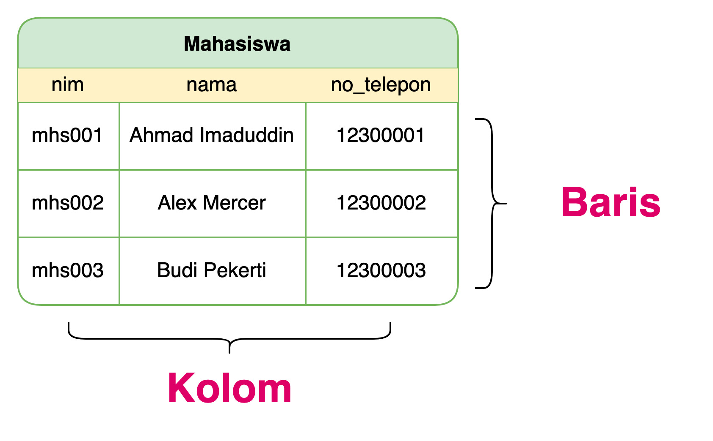
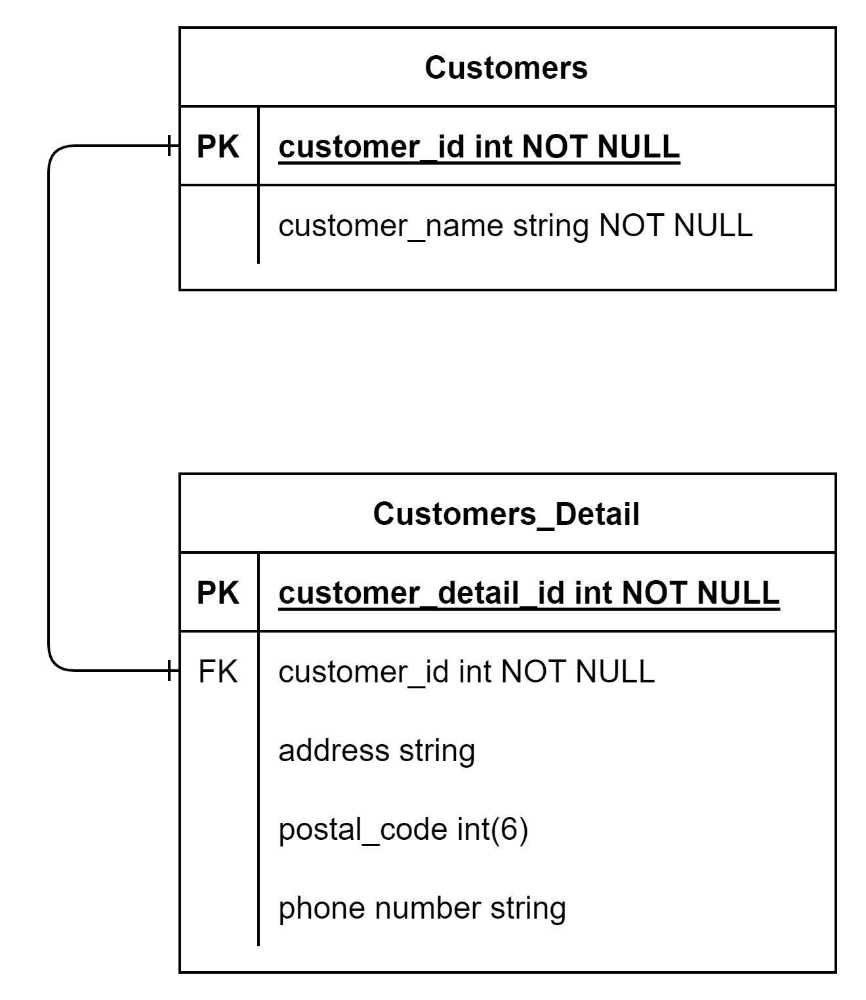
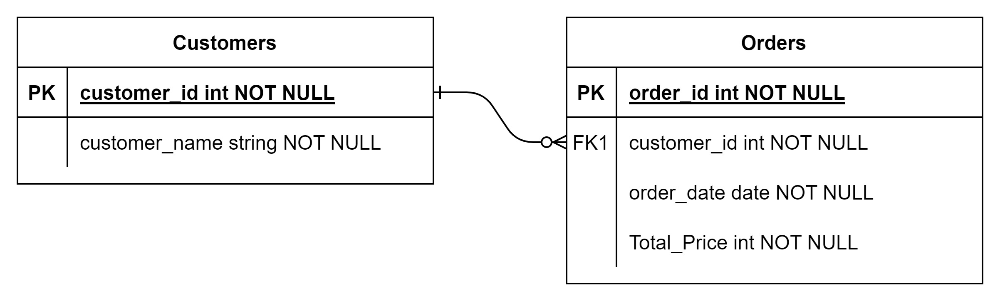
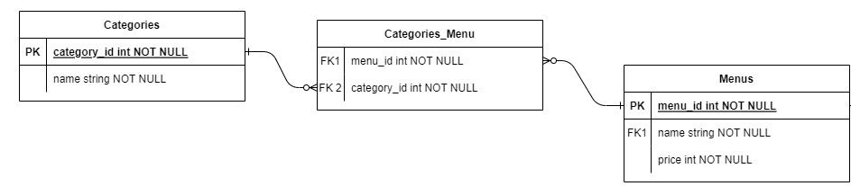

1. Pengenalan DataBase

Database atau basis data adalah kumpulan informadi yang disimpan di dalam komputer secara sistematik sehingga dapat diperiksa menggunakan suatu program komputer untuk memperoleh informasi dari basis data tersebut. Kegunaan utama sistem basis data adalah agar pemakai mampu menyusun suatu pandangan (view) abstraksi data.

2. Apa itu Relational Database? 

kumpulan data disimpan dalam suatu tabular (tabel). Lalu, dalam suatu tabel terdapat baris & kolom (row & column).  Misalnya, kita memiliki kumpulan data mahasiswa suatu universitas, jika disimpan ke dalam tabel seperti ini bentuknya.

3. Relasi Dalam DataBase

- One to One
Relasi One to One adalah relasi yang mana setiap satu baris data pada tabel pertama hanya berhubungan dengan satu baris pada tabel kedua.

- One to Many
Relasi One to Many adalah relasi yang mana setiap satu baris data pada tabel pertama berhubungan dengan lebih dari satu baris pada tabel kedua.

- Many to Many
Relasi Many to Many digunakan untuk menggabungkan 2 buah tabel dimana kedua tabel sama sama memiliki lebih dari satu record yang dapat terhubung. Biasanya relasi jenis ini memerlukan 1 tabel pendukung diantara tabel yang ingin dibuat relasi. Contohnya adalah pada hubungan relasi antara tabel Menus dan Categories dimana satu menu bisa memiliki banyak category dan satu category bisa dimiliki oleh banyak menu.

4. Jenis jenis Perintah SQL

- Data Defenition Language(DDL)
    - `Crete database <database_name>` 
    - `Use <database_name>`
    - `Create table`
    - `Drop table`
    - `Rename table`
    - `ALTER table`

- Data Manipulation Language(DML)
    - `Insert into <table_name> values(values1,values2)`
    - `Select * from <table_name>`
    - `Update from <table_name>`
    - `Delete from <table_name>`

- Data Control Language(DCL)
    - `Like / Between`
    - `And / Or`
    - `Order By`
    - `Limit`
    - `Join`
    - `Union`
    - `Agregate (Min, Max, Sum, Avg, Count, Having)`
    - `Subquery`
    - `Function`